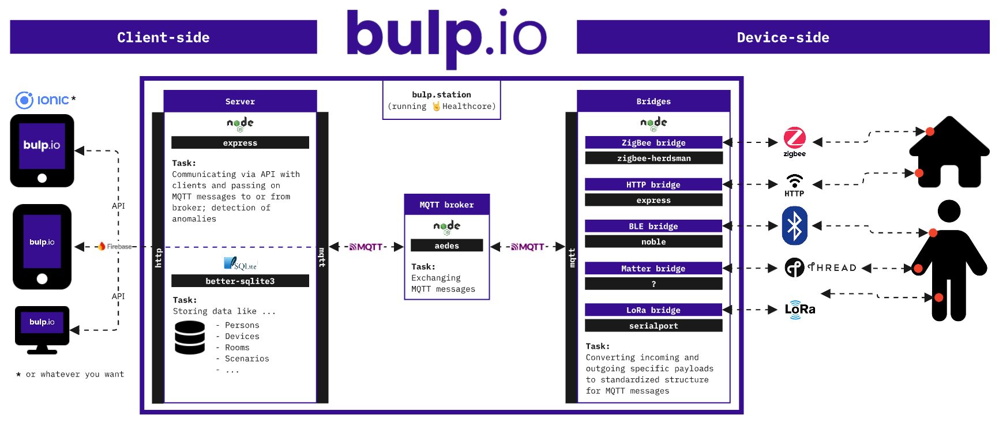

# healthcore.dev by bulp.io
Hi.

Welcome to healthcore.dev!

But wait: **what the hell is healthcore.dev**?

healthcore.dev (or simply healthcore) is part of the **open software and hardware architecture of [bulp.io](https://www.bulp.io)**. With bulp, healthcare devices from any manufacturer can communicate with each other and any interface through a variety of protocols and APIs. In this way, bulp centrally captures a person's **condition in many different ways**, reacts automatically to changes in their environment, and optionally informs caregivers, nurses or family members.

The healthcore is the software core (obviously!) that **standardizes** the data from various devices, processes scenarios, and triggers actions. A simple API allows interfaces such as apps to visualize the device data.

Healthcore can **run on any hardware** — a Raspberry Pi, a PC, or any other device with a Linux system or Windows. The choice is yours.

Just imagine something like Home Assistant or OpenHAB, but specialized for healthcare. **That’s exactly what this is**.

Let’s democratize and de-monopolize the healthcare sector.

🤘HEALTHCORE!!!🤘

-----------

### 🏗️ [Architecure](#%EF%B8%8F-architecture)
### 💻 [Installation (software)](#-installation-software)
### 🔧 [Installation (hardware)](#-installation-hardware)
### 📁 [Folder structure](#-folder-structure)
### 📡 [MQTT topics and messages](#-mqtt-topics-and-messages)
### 🧩 [Own converters](#-own-converters)
### 🔌 [API communication](#-api-communication)

## 🏗️ Architecture
Let’s take a look at the **architecture** of bulp.io:

In the middle — that’s the healthcore. The healthcore consists of several Node.js servers with different tasks. The Node.js servers communicate with each other via MQTT. The most important thing is that there is a separate bridge for each protocol, which standardizes the incoming and outgoing data of the devices. The healthcore supports the following protocols:
- Bluetooth
- ZigBee
- Thread
- LoRa P2P
- HTTP

And now the best part: you can **add your own devices to the healthcore**! Each bridge includes a list of classes for devices. So you can handle the data transformation with simple JavaScript in a class for your device (= very cool). 

On the left, you can see how various interfaces communicate bi-directionally with the healthcore via a standardized API and visualize the data, for example. Just **bring your own interface**.

## 💻 Installation (software)

## 🔧 Installation (hardware)

## 📁 Folder structure

## 📡 MQTT topics and messages

## 🧩 Own converters

## 🔌 API communication