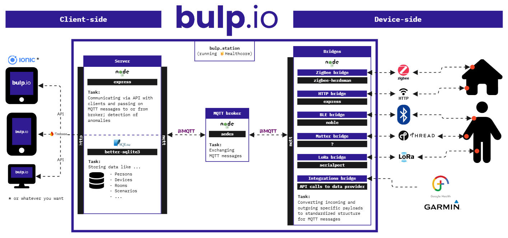

# healthcore.dev by bulp.io
Hi. Welcome to healthcore.dev! But what is healthcore.dev?

healthcore.dev (or simply healthcore) is part of the **open software and hardware architecture of [bulp.io](https://www.bulp.io)**. With bulp, healthcare devices from any manufacturer can communicate with each other through a variety of protocols and APIs. In this way, bulp centrally captures a person's **condition in many different ways**, reacts automatically to changes in their environment, and optionally informs caregivers, nurses, or family members.

The healthcore is the software core (obviously!) that **standardizes** the data from various devices, processes scenarios, and triggers actions. A simple API allows interfaces such as apps to visualize device data.

Healthcore can **run on any hardware** — a Raspberry Pi, a PC, or any other device running a Linux system or Windows. The choice is yours.

Just imagine something like Home Assistant or OpenHAB, but specialized for healthcare. **That’s exactly what this is**.

Let’s take a look at the **architecture**:

We'll start on the right:
There are many devices from different manufacturers that want to collect and send data. Using **protocols** like
- Bluetooth
- ZigBee
- Thread
- LoRa(WAN)
- HTTP
  
these devices can communicate with the healthcore.

On the left, you can see how various interfaces communicate bi-directionally with the healthcore via a standardized API and visualize the data, for example. Just **bring your own interface**.

And in the middle — that’s the healthcore. The healthcore consists of several Node.js servers with different tasks. Most importantly, there is a dedicated bridge for each protocol that standardizes incoming and outgoing data. The Node.js servers communicate with each other via MQTT. And now the best part: you can add your own devices to healthcore! Each bridge includes a list of classes for devices. So you can handle the data transformation with simple JavaScript in a class for your device. Cool, huh?

Stay tuned. More info and code V0.1 is coming soon.

So, let’s democratize and de-monopolize the healthcare sector.

🤘HEALTHCORE!!!🤘
