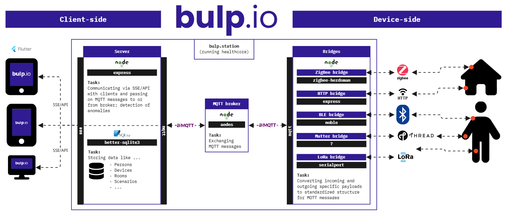

# healthcore.dev by bulp.io
Hi.

Welcome to healthcore.dev❗️

But wait: **what the hell is healthcore.dev**❓

healthcore.dev (or simply healthcore) is part of the **open software and hardware architecture of [bulp.io](https://www.bulp.io)**. With bulp, healthcare devices from any manufacturer can communicate with each other and any interface through a variety of protocols and APIs. In this way, bulp centrally captures a person's **condition in many different ways**, reacts automatically to changes in their environment, and optionally informs caregivers, nurses or family members.

The healthcore is the software core (obviously!) that **standardizes** the data from various devices, processes scenarios, and triggers actions. A simple API allows interfaces such as apps to visualize the device data.

Healthcore can **run on any hardware** — a Raspberry Pi, a PC, or any other device with a Linux system or Windows. The choice is yours.

Just imagine something like Home Assistant or OpenHAB, but specialized for healthcare. **That’s exactly what this is**.

Let’s democratize and de-monopolize the healthcare sector.

🤘HEALTHCORE!!!🤘

## 👉 Read more about ...

- 🏗️ [Architecture](#%EF%B8%8F-architecture)
- 💻 [Installation (software)](#-installation-software)
- 📁 [Folder structure](#-folder-structure)
- 🔧 [Installation (hardware)](#-installation-hardware)
- 🧩 [Own converters](#-own-converters)
- 🔌 [API communication](#-api-communication)

## 🏗️ Architecture
Let’s take a look at the **architecture** of bulp.io:


In the middle — that’s the healthcore. The healthcore consists of several Node.js servers with different tasks. The Node.js servers communicate with each other via MQTT. The most important thing is that there is a separate bridge for each protocol, which standardizes the incoming and outgoing data of the devices. The healthcore supports the following protocols:
- Bluetooth
- ZigBee
- Thread
- LoRa P2P
- HTTP

And now the best part: you can **add your own devices to the healthcore**! Each bridge includes a list of classes for devices. So you can handle the data transformation with simple JavaScript in a class for your device (= very cool). 

On the left, you can see how various interfaces communicate bi-directionally with the healthcore via a standardized API and visualize the data, for example. Just **bring your own interface**.

## 💻 Installation (software)

**Prerequisites**
- Node.js (v22 or higher) and npm
- MySQL database; client tools for schema import

**Project setup**
1. Clone/download the repository and `cd` into its root.
2. Create `.env.local` to override defaults; fill in:
   - MySQL database credentials: `CONF_dbHost`, `CONF_dbName`, `CONF_dbUser`, `CONF_dbPass`, `CONF_dbPort`
   - Adapter paths: `CONF_zigBeeAdapterPort`, `CONF_zigBeeAdapterName`, `CONF_loRaAdapterPath`, 
3. Install dependencies:
   ```bash
   npm install
   ```
4. Import the database schema:
   ```bash
   mysql -u <user> -p <db_name> < healthcore_db.sql
   ```

**Start services** (each in its own terminal or managed via a process manager):
```bash
# MQTT broker
node broker/app.js

# Server
node server/app.js

# Bridges
node "bridge - bluetooth/app.js"
node "bridge - zigbee/app.js"
node "bridge - lora/app.js"
node "bridge - http/app.js"

```

## 📁 Folder structure
```plaintext
├── broker/               # MQTT broker
├── server/               # Server
│   ├── routes/           # Routes for communication Server ↔ Interface via API 
│   └── sse/              # Routes for communication Server ↔ Interface via SSE (Server-Sent Events)
├── bridge - bluetooth/   # Bluetooth ↔ MQTT bridge
│   └── converters/       # Common and own converters
├── bridge - zigbee/      # ZigBee ↔ MQTT bridge
│   └── converters/       # Common and own converters
├── bridge - lora/        # LoRa ↔ MQTT bridge
│   └── converters/       # Common and own converters
├── bridge - http/        # HTTP ↔ MQTT bridge
│   └── converters/       # Common and own converters
└── test_devices/         # Example device firmware (for Arduino)
```

## 🔧 Installation (hardware)
- **Host platform**  
  - Raspberry Pi 4 or (or better) or any Linux/Windows PC with network access
- **Adapters**  
  - **Bluetooth**: Built-in BLE or USB dongle  
  - **ZigBee**: USB coordinator (e.g. CC2531, ConBee II, Sonoff Zigbee 3.0 USB stick)  
  - **LoRa**: USB or serial LoRa adapter (e.g. Dragino LA66 LoRaWAN USB Adapter)
- **Connections**  
  - Plug adapters into host; note device paths (e.g. `/dev/ttyUSB0` or `COMx`) and set in `.env.local`

## 🧩 Own converters
The **Own converters** subsystem lets you transform raw device data (e.g., binary BLE characteristic values) into structured JSON properties that your interface (i.e. your app) can use. Each bridge (Bluetooth, ZigBee, LoRa, HTTP) has its own `converters/` folder with individual converter classes extending a shared `ConverterStandard` base. Below is a detailed Bluetooth bridge example:

1. **Create** a new JS file in the bridge’s `converters/` folder (e.g. `Converter_MyConverter.js`).
2. **Extend** `ConverterStandard`:

   In `Converter_MyConverter.js`, import the base and declare your class:  

   ```js
   const { ConverterStandard } = require("../ConverterStandard.js");

   class Converter_MyConverter extends ConverterStandard {
     // Must exactly match the `productName` advertised by the BLE peripheral
     static productName = "My Converter";

     constructor() {
       super();
       // Map friendly names to BLE service & characteristic UUIDs
       this.properties = {
         temperature: { service: "181A", characteristic: "2A6E" },
         humidity:    { service: "181A", characteristic: "2A6F" },
         battery:     { service: "180F", characteristic: "2A19" }
       };
     }

     /**
      * Override `get` when raw values need custom conversion logic.
      * @param {Object} propDescriptor  One of the entries from this.properties
      * @param {Buffer}    rawBuffer     Raw data read from the characteristic
      * @returns Parsed JavaScript value (number, string, etc.)
      */
     get(propDescriptor, rawBuffer) {
       const uuid = propDescriptor.characteristic;
       // Example: temperature is uint16 in hundredths of °C
       if (uuid === "2A6E") {
         // rawBuffer.readUInt16LE returns an integer; divide by 100 to get °C
         return rawBuffer.readUInt16LE(0) / 100;
       }
       // Fallback to standard conversions (e.g., battery, humidity)
       return super.getStandard(propDescriptor, rawBuffer);
     }
   }

   module.exports = { Converter_MyConverter };

3. **Auto-load**: `Converters.js` dynamically requires all files in `converters/` (excluding `ConverterStandard.js`), detects the static `productName`, and registers your class.

## 🔌 API communication
Coming soon